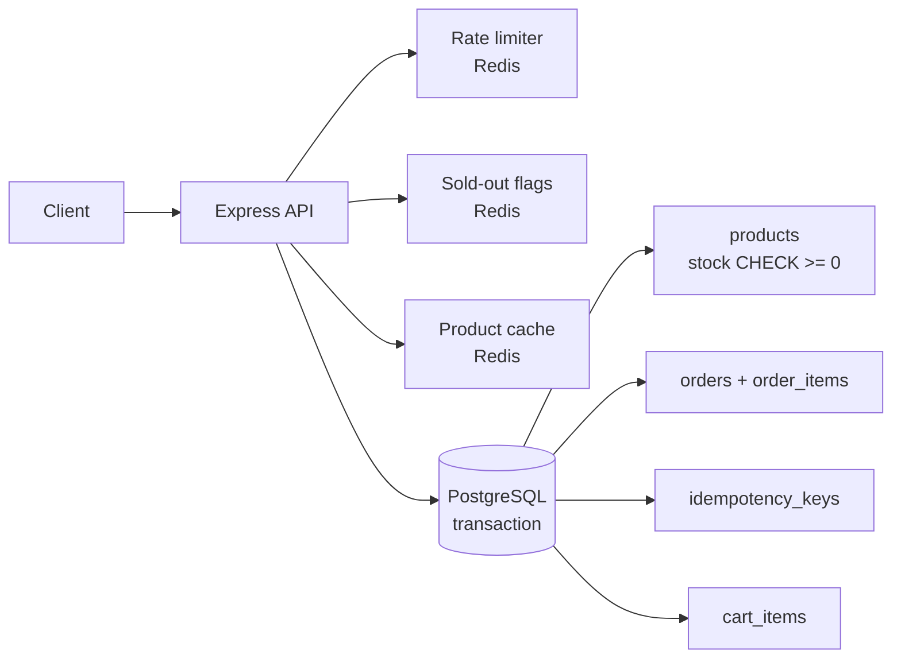

# Flash-Sale Order System

A backend service that survives a flash sale: thousands of buyers fight over a few units of stock and **the inventory never goes negative, no order is ever created twice, and the API keeps working even if Redis dies.**

**Stack:** Node.js · Express · PostgreSQL · Redis · Jest · Docker

## The problem

During a flash sale, many users click "Buy" for the last items at the same moment. Naive code (`read stock → check → write stock`) has a race condition, so two buyers both see "1 left" and both succeed (**overselling**). Mobile users also retry on slow networks, so one click can become two orders (**duplicate charges**). This project solves both.

## Features

- Products, carts, checkout, order history and order cancellation (with stock restored)
- **Oversell-proof checkout** using a PostgreSQL transaction with `SELECT ... FOR UPDATE` row locking
- **Idempotent checkout** via an `Idempotency-Key` header, so retries and double-clicks never create a second order
- **Deadlock-free** multi-item carts (rows are always locked in ascending id order, plus automatic retry on deadlock)
- **Redis layer** for product caching (cache-aside), per-user rate limiting and "sold-out" flags that keep doomed requests off the database
- **Fail-open design:** Redis is an optimisation, not a dependency, so if it is down the API still works correctly
- 19 automated tests including concurrency tests, plus a load simulator that audits the database afterwards

## Architecture



### Checkout flow (`src/services/orderService.js`)

```
1. Redis pre-check: any item flagged sold-out?  -> 409 immediately (no DB work)
2. BEGIN
3. Claim Idempotency-Key (INSERT ... ON CONFLICT DO NOTHING)
      already claimed -> return the stored response (replay)
4. Read cart
5. SELECT products ... ORDER BY id FOR UPDATE      <- locks rows, serialises buyers
6. Verify stock while holding the locks             <- cannot be raced
7. UPDATE stock, INSERT order + items, DELETE cart
8. Store response under the idempotency key
9. COMMIT  (any error before this = full rollback)
10. After commit: invalidate cache, flag products that reached 0 stock
```

## Quick start

### Option A: Docker (easiest, works on Windows/Mac/Linux)

```bash
docker compose up --build
# API is on http://localhost:3000
docker compose exec api node scripts/seed.js     # optional sample data
```

### Option B: run Node locally, databases in Docker

```bash
docker compose up -d db redis
cp .env.example .env            # Windows: copy .env.example .env
npm install
npm run migrate                 # creates tables
npm run seed                    # 3 products + 5 users
npm start                       # http://localhost:3000
```

Already have PostgreSQL and Redis installed? Skip Docker and edit `DATABASE_URL` / `REDIS_URL` in `.env`.

### Try it

Open `requests.http` in VS Code (install the "REST Client" extension) and click *Send Request*, or use curl:

```bash
curl -X PUT localhost:3000/cart/items/1 -H "X-User-Id: 1" -H "Content-Type: application/json" -d '{"quantity":1}'
curl -X POST localhost:3000/checkout -H "X-User-Id: 1" -H "Idempotency-Key: order-001"
curl -X POST localhost:3000/checkout -H "X-User-Id: 1" -H "Idempotency-Key: order-001"   # same key => replay, no 2nd order
```

## API

Customer endpoints need `X-User-Id: <id>` (demo auth). Admin endpoints need `X-Admin-Key`.

| Method | Path | Description |
|---|---|---|
| POST | `/users` | Register `{name, email}` |
| GET | `/products`, `/products/:id` | Browse (cached; `X-Cache: HIT/MISS`; send `Cache-Control: no-cache` to bypass) |
| POST | `/products` | **Admin.** Create `{name, priceCents, stock}` |
| PATCH | `/products/:id` | **Admin.** Update price/stock (restock clears sold-out flag) |
| GET | `/admin/products/:id/audit` | **Admin.** Inventory audit: `stock + confirmedUnits` must equal initial stock |
| GET | `/cart` | View cart |
| PUT | `/cart/items/:productId` | Set quantity `{quantity}` (0 removes; max 5 per product) |
| DELETE | `/cart/items/:productId` | Remove item |
| POST | `/checkout` | **Requires `Idempotency-Key` header.** Creates the order |
| GET | `/orders`, `/orders/:id` | Order history / details |
| POST | `/orders/:id/cancel` | Cancel and restock |
| GET | `/health` | Postgres and Redis status |

Errors look like `{ "error": { "code": "INSUFFICIENT_STOCK", "message": "...", "details": {...} } }`.

## Tests and load simulation

```bash
# Tests use a separate DB. Create it once:  createdb flashsale_test   (or via docker exec)
npm test
```

With Docker, create the test database once: `docker compose exec db psql -U postgres -c "CREATE DATABASE flashsale_test;"`

Key tests (`tests/checkout.test.js`):
- 60 buyers race for 10 units → **exactly 10 orders**, stock ends at 0
- 8 parallel requests with the same idempotency key → **exactly 1 order**
- 30 carts with items added in opposite order → **no deadlocks**
- 5 concurrent cancels → **stock restored exactly once**
- Failed checkout rolls back everything (including multi-item carts)

**Load simulation** (API must be running):

```bash
BUYERS=500 STOCK=50 DUP_RATE=0.3 npm run simulate      # Windows PowerShell: $env:BUYERS=500; npm run simulate
```

It fires all checkouts at once (including duplicate double-clicks), then audits the database and prints throughput, p50/p95/p99 latency, and whether any invariant was violated. **Run it on your own machine and use your own numbers on your resume.**

## Design decisions and trade-offs

| Decision | Why | Trade-off |
|---|---|---|
| Pessimistic locking (`FOR UPDATE`) | Simple, correct, gives clear per-item error messages | Buyers of the *same* product queue behind one row lock. Throughput on a single hot product is bounded by transaction time |
| DB `CHECK (stock >= 0)` | Safety net if app code ever has a bug | Only a backstop, so the lock is what prevents errors |
| Idempotency key claimed *inside* the transaction | Concurrent duplicates wait on the unique index, and a failed attempt rolls the key back so the client can retry | The key is not bound to a request hash, and old keys need periodic cleanup (e.g. 24h TTL job) |
| Cart does not reserve stock | Prevents bots hoarding inventory in carts | A user can reach checkout and find the item gone |
| Redis fails open | Cache/rate limit are optimisations; correctness lives in Postgres | While Redis is down there is no rate limiting |
| Cache-aside + invalidate on write | Fast reads for the hot product page | Small race: a read that started before a commit can re-cache stale stock until TTL. Displayed stock is approximate, and checkout always checks the DB |
| Payment is simulated | Keeps the focus on inventory and concurrency | A real system would call a payment provider *outside* the DB transaction and handle failures with a saga/compensation |

## Ideas to extend it (good for interviews)

1. Add a real payment step (Stripe test mode) using a `PENDING → CONFIRMED` order state machine and a reservation timeout job.
2. Replace header auth with JWT.
3. Compare strategies and benchmark them: `UPDATE ... WHERE stock >= qty` (optimistic), Redis Lua atomic decrement, or a queue (SQS) that serialises purchases per product.
4. Deploy on AWS: EC2 or Elastic Beanstalk for the API, RDS PostgreSQL, ElastiCache Redis, load-balanced behind an ALB. Then load-test with k6.
5. Add Prometheus metrics (orders/sec, lock wait time) and structured logging.

## Project structure

```
src/
  app.js, server.js          Express app + startup / graceful shutdown
  config.js, db.js, redis.js Config, PG pool + withTransaction (deadlock retry), fail-open Redis helpers
  routes/index.js            All HTTP routes
  services/orderService.js   Checkout / cancel transactions   <-- start reading here
  services/productService.js, cartService.js, soldOut.js
  middleware/                auth, rate limit, error handling
db/schema.sql                Tables, constraints, indexes
scripts/                     migrate, seed, simulate-flash-sale
tests/                       Jest + Supertest (needs real Postgres + Redis)
docs/INTERVIEW_NOTES.md      Questions you should be able to answer about this project
```

## Resume bullets

Use the measured numbers from *your* `npm run simulate` runs in place of the brackets:

> **Flash-Sale Order System** | Node.js, Express, PostgreSQL, Redis, Docker, Jest
> - Built an e-commerce checkout backend that prevents overselling under concurrent load using PostgreSQL transactions, `SELECT ... FOR UPDATE` row locking and consistent lock ordering to avoid deadlocks; verified with automated tests (60 concurrent buyers for 10 units → exactly 10 orders).
> - Implemented idempotent checkout (`Idempotency-Key`) so retries and duplicate clicks never create duplicate orders; validated with parallel-request tests.
> - Added a Redis layer (cache-aside product reads, per-user rate limiting, sold-out flags) designed to fail open; load-tested **[N] concurrent buyers at [X] req/s, p95 [Y] ms** with zero oversells.
